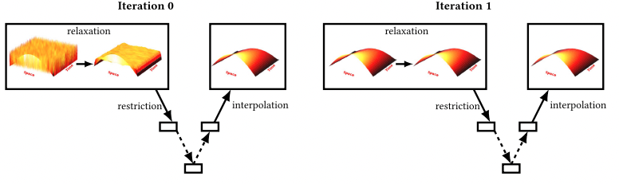
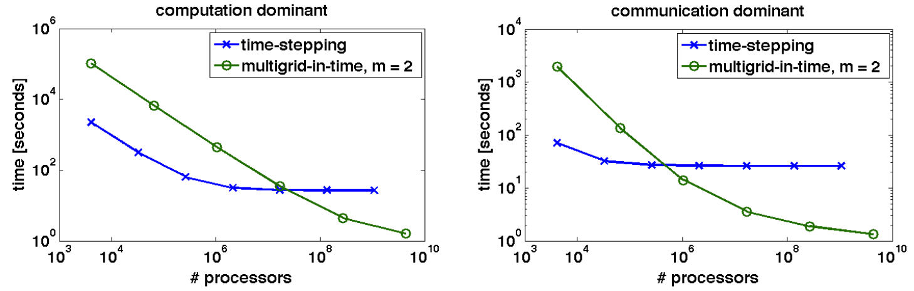

# Parareal.jl

A [Julia] implementation of the [Multi-Grid-Reduction-In-Time (MGRIT)][MGRIT] parallel-in-time solver for differential equations.
Despite the importance of solving differential equations, [most solver suites lack any form of parallelization](https://www.stochasticlifestyle.com/comparison-differential-equation-solver-suites-matlab-r-julia-python-c-fortran/).
When parallelism is present, it is often parallelism within a single time step (i.e. via spatial decomposition).
This is highly applicable when solving massive Partial Differential Equations (PDEs), but less so for smaller ODEs computed over long time intervals.
This project aims to provide a MGRIT solver for a shared memory parallel environment using [Julia's threading facilities][julia-multithreading].


### Final Report and Presentation

Please see the linked documents for the [final report](docs/report.pdf).

## Background

MGRIT works by solving iteratively solving the system on a increasingly finer temporal grid, in parallel.
The fine solution is then used to update the coarse solution, sweeping back up the levels of temporal resolution.
This process is repeated until the desired level of accuracy is achieved.
Effectively, MGRIT is a generalization of the [Parareal Method][Parareal] from a two-level temporal hierarchy (Parareal) to at most `log T` levels for `T` time.
This hierarchy of temporal grids enables near optimal and work-efficient parallel decomposition of the problem.


> Two iterations of MGRIT for 2D Heat Conduction  Source: [Algorithm 1016: PyMGRIT: A Python Package for the
Parallel-in-time Method MGRIT][PyMGRIT]

For a two level hierarchy this results in the following pseudoscope, which is effectively the same as the [Parareal Method][Parareal].

```julia
"""
dt = Minimum time step step of the fine grid
m = Number of coarse grid points per fine grid point
T = Total time of the problem
y0 = Initial condition
"""
function solve(y0, T, m, dt)
    # Assume an initially constant solution
    y = repeat(y0, T/dt)

    while !converged
        # Using the coarse solution, update the fine solution in parallel
        @threads for t = 1:m:T/dt
            y[t+1:t+m] = solve_fine(y[t])
        end

        # Using the fine solution, update the coarse solution in parallel
        # This is taking the final solution from the fine solution (y[t+m*dt]) and
        # using it to update the next coarse point (y[t+2*m*dt])
        @threads for t = m:m:T/dt
            y[t+m] = solve_coarse(y[t])
        end
    end
end
```

Recursively decomposing the above problem via `solve_fine(y) = solve(y0, m*dt, m*2, dt/2)` gives the MGRIT method.
As such, the algorithm has there distinct axes of parallelism:

1. Updating the fine temporal grid in parallel
2. Updating the coarse temporal grid in parallel
3. Within the differential: `dy = f(y)`

## Challenges

MGRIT has been shown to provide near optimal scaling, there are some challenges that I hope to explore over the course of the project:

1. While the above code shows two sequential parallel loops, a fork-and-join approach is also possible.
2. Exploiting parallelism within the differential, may be advantageous for some levels of the temporal multigrid.
3. Viable parallelism is likely problem dependent. For example, the quality of the coarse-grid solution for a low-order equations (i.e. [projectile motion](https://en.wikipedia.org/wiki/Projectile_motion)) is likely to be much better than a chaotic system (ie. [strange attractors](https://en.wikipedia.org/wiki/Attractor#Strange_attractor)). Achiving good speed-up will require balancing parallelism-in-time with in differential parallelism.

## Resources

For this project I plan on building on Julia's already fantastic ecosystem, notably:

1. Various solvers (But not MGRIT) for Differential Equations will be provided by [DifferentialEquations.jl][DiffEq.jl]. With the ultimate goal of providing a MGRIT solver that is compatible with [DifferentialEquations.jl][DiffEq.jl].
2. Julia's builtin [threading primitives][julia-multithreading] and other threading libraries such as [Polyester.jl](https://github.com/JuliaSIMD/Polyester.jl) and [LoopVectorization.jl](https://github.com/JuliaSIMD/LoopVectorization.jl).

Additionally, I wil be referring extensively to both the [MGRIT paper][MGRIT] and the [PyMGRIT package][PyMGRIT] implementation for the technical details of the algorithm.

### Computing Resources

As [Julia] runs on a range of hardware, I plan on doing most of my development work on my laptop (Mac M1 Processor).
For testing at large thread counts, I plan on either leverage the [Bridges2 RM-machines](https://www.psc.edu/resources/bridges-2/) or the latest node on [Arjuna] featuring 2 AMD EPYC 7713 64-Core Processor (Pending Advisor Approval).

## Deliverables

- 75% Goal: Functional Parareal solver if generalizing to multi-grid provides poor scaling
- 100% Goal: Functional MGRIT solver
- 125% Goal: Functional MGRIT solver with dynamic trade-off between in-time and in-differential parallelism

## Platform Choice

[Julia] is fantastic language for scientific computing with a [fantastic ecosystem](https://www.stochasticlifestyle.com/comparison-differential-equation-solver-suites-matlab-r-julia-python-c-fortran/) for solving differential equations.
In my research (Modeling Battery Dynamics with Scientific Machine Learning), it is my primary language of development due to it's speed, dynamism and multiple dispatch abilities.
Thus from a learning perspective applying the concept from [class](https://www.cs.cmu.edu/afs/cs/academic/class/15418-s22/www/index.html) to [Julia] is key.

Machine-wise, running code faster on my personal machine has an immediate impact on my productivity, while testing on more powerful machines (i.e. [Arjuna]) be useful for benchmarking (It's a brand new machine) and my research goals.

## Milestone Update

Initial implementation of Parareal using Julia has been completed, and testing shows that it is comparable to the reference Runge-Kutta 4th order solver.
Benchmarking suggests that allocations are limiting performance, and are likely the primary bottleneck (See below).
Overall, I think progress is on track for presenting a small demo during the poster sessions and graphs of scaling as a function of problem size / work partitioning.
An updated schedule is provided below for reference.

I am concerned that my initial 125% goal is not feasible (Discussion below), and plan to pivot towards using GPUs to hit the core counts needed to beat out in-differential parallelism.

### Threaded Solution with 8 threads

```julia
julia> @benchmark solve!($integrator)
BenchmarkTools.Trial: 56 samples with 1 evaluation.
 Range (min … max):  82.123 ms … 102.261 ms  ┊ GC (min … max): 0.00% … 11.73%
 Time  (median):     87.820 ms               ┊ GC (median):    0.00%
 Time  (mean ± σ):   90.104 ms ±   5.794 ms  ┊ GC (mean ± σ):  3.75% ±  5.27%

        ▅   ▂ ▂▂█     ▂
  ▅▅▁▁█▁█▅▁██▅███▅▅▅█▅█▅▅▅▁▁▁▁▁▅▁▁▁▁▁▅▁▅▁▁▁▁██▁█▅▅▁▅▁█▁▅▁▁▁▁▅▅ ▁
  82.1 ms         Histogram: frequency by time          102 ms <

 Memory estimate: 48.17 MiB, allocs estimate: 916475.
```

### Reference Implementation provided by [DifferentialEquations.jl][DiffEq.jl]

```julia
julia> @benchmark solve!($integrator_ref)
BenchmarkTools.Trial: 10000 samples with 952 evaluations.
 Range (min … max):  92.043 ns … 129.026 ns  ┊ GC (min … max): 0.00% … 0.00%
 Time  (median):     92.481 ns               ┊ GC (median):    0.00%
 Time  (mean ± σ):   92.824 ns ±   1.350 ns  ┊ GC (mean ± σ):  0.00% ± 0.00%

    ▃█▆▁                    ▃▃                                 ▁
  ▇█████▇▅▆▅▄▅▄▄▅▇▇▇▅▄▅▃▃▄▅▄██▆▆▆▅▅▄▄▅▃▄▄▅▄▅▆▄▅▄▄▃▄▄▃▁▅▄▅▄▅▅▆▅ █
  92 ns         Histogram: log(frequency) by time      99.4 ns <

 Memory estimate: 0 bytes, allocs estimate: 0.
```

Allocations are currently due to the `reinit` call within `solve!`, which appears to trigger significant allocations.
Presently, I've been able to use `set_ut!` for the coarse integrator, but this won't work for the fine integrators, where we **need** to save additional state information (i.e. `∂u`).

Further, given the notes in the [MGRIT paper][MGRIT] regarding scaling, I suspect I will need a very high core count to beat out spatial partitioning.
Although, for a smaller systems the cross-over point should occur at a lower processor counts.


> Runtimes as a function of processors for a 1,024^3 x 16,386 domain with varying number of processors.
> For small problems, the cross-over point occurs at lower (but still large) processor counts.
> Note: These are theoretical runtimes presented in the paper.

### Goal Progress

- [x] Functional Parareal solver (75% Goal)
- [X] Functional MGRIT solver (100% Goal)
- [ ] MGRIT solver with dynamic trade-off between in-time and in-differential parallelism (125% Goal)

I am on track for delivering my 100% goal of an MGRIT solver, I am concerned about reaching the 125% goal.
Primarily, I have not found anything in the literature regarding dynamically trading-off in-time and in-differential parallelism.
Additionally, on further review of the [MGRIT paper][MGRIT], I believe I will need a large (~1k) processors to beat out spatial partitioning for a 128^3 spatial domain.
To that end, I want to move towards using GPUs to accelerate the fine solvers, with the hope that number of execution cores will be sufficient to beat out spatial partitioning.

## Schedule

- [x] Initial implementation of Parareal using Julia (1/11)
- [x] Build out benchmarking suite and eliminate allocations in the fine solvers (4/14)
- [x] Implement MGRIT solver (4/18)
- [ ] ~~Initial GPU Accelerated Implementation (4/21)~~
- [ ] ~~Refined GPU Accelerated Implementation (4/25)~~
- [x] Initial Benchmark on ~~Nvidia A100s vs.~~ AMD EPYC CPUs (4/27)
- [x] Document in Report (4/5)
- [x] Presentation of final results (5/5)

As MGRIT was able to archive >1 speedup over serial algorithms, I have elected to not purse the strech goal of a GPU accelerated implementation.
### References

- [A Multigrid-in-Time Algorithm for Solving Evolving Equation in Parallel][MGRIT]
- [A "parareal" in time discretication of PDE's][Parareal]
- [PyMGRIT: A Python Package for the Parallel-in-time Method MGRIT][PyMGRIT]
- [DifferentialEquations.jl][DiffEq.jl]
- [Julia]
- [Arjuna] - A Multi-Departmental Computer Cluster that I help administer

[Julia]: https://julialang.org/
[MGRIT]: https://www.osti.gov/servlets/purl/1073108
[Parareal]: https://doi.org/10.1016/S0764-4442(00)01793-6
[PyMGRIT]: https://dl.acm.org/doi/pdf/10.1145/3446979
[DiffEq.jl]: https://diffeq.sciml.ai/stable/
[julia-multithreading]: https://docs.julialang.org/en/v1/manual/multi-threading/
[Arjuna]: https://arjunacluster.github.io/ArjunaUsers/
